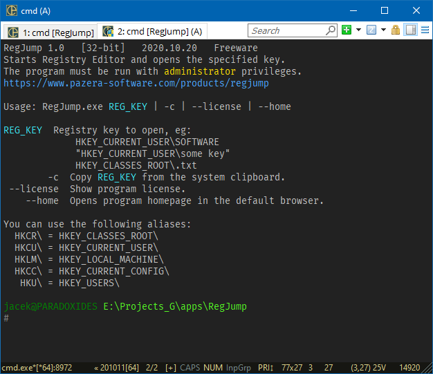

# RegJump

## Overview

Starts Registry Editor and opens the specified key.  
The program must be run with **administrator** privileges.

This program is very similar to [RegJump](https://docs.microsoft.com/en-us/sysinternals/downloads/regjump) from SysInternals, but is open source and has a less restrictive license.

## Download

Source: https://github.com/jackdp/RegJump

Compiled binaries (Windows 32-bit and 64-bit): https://www.pazera-software.com/products/regjump/

## Usage

`RegJump.exe REG_KEY | -c | --license | --home`

### Options

`REG_KEY` - Registry key to open, eg:  
HKEY_CURRENT_USER\SOFTWARE  
"HKEY_CURRENT_USER\some key"  
HKCU\SOFTWARE\Microsoft\Windows\CurrentVersion\Applets\Regedit  
HKEY_CLASSES_ROOT\\.txt

| Option         | Description               |
|----------------|---------------------------|
| `-c`           | Copy `REG_KEY` from the system clipboard.        |
| `--license`    | Display program license.                         |
| `--home`       | Opens program homepage in the default browser.   |

You can use the following aliases:
| Alias | Real value           |
|-------|----------------------|
| HKCR\ | HKEY_CLASSES_ROOT\   |
| HKCU\ | HKEY_CURRENT_USER\   |
| HKLM\ | HKEY_LOCAL_MACHINE\  |
| HKCC\ | HKEY_CURRENT_CONFIG\ |
| HKU\  | HKEY_USERS\          |

### Exit codes

| Exit code | Description   |
|-----------|---------------|
| 0         | OK (no error) |
| 1         | Error         |

## License

Freeware, OpenSource  
This program is completely free. You can use it without any restrictions, also for commercial purposes.  
The program's source files are available at https://github.com/jackdp/RegJump  
Compiled binaries can be downloaded from https://www.pazera-software.com/products/regjump

## Compilation

To compile, you need the [Delphi IDE](https://www.embarcadero.com/products/delphi) (the free [Community](https://www.embarcadero.com/products/delphi/starter/free-download) version is enough).

How to build:

1. Open `src\RegJump.dproj` file with the Delphi.
2. Build project (menu `Project->Build`).

## Releases

2020.10.20 - Version 1.0
